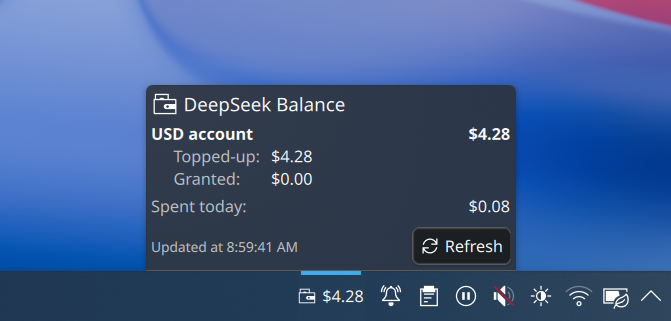

# DeepSeek Balance

A KDE Plasma 6 applet that shows the balance of a DeepSeek API account, either
in a panel or on the desktop.

It calls `GET https://api.deepseek.com/user/balance` with your API key on a
timer and shows the total, topped-up, and granted balance for each currency
DeepSeek returns. It also estimates how much was spent today, shown in the
tooltip and the expanded view.



## Requirements

- Plasma 6 (`plasmashell 6.x`), `kpackagetool6`.
- For development and tests only: a Qt 6 QML runtime (`qml6`) and Qt 6
  `qmllint`. On Arch several Qt 5 tools sit in `/usr/bin`; the Qt 6 ones are in
  `/usr/lib/qt6/bin`, so `/usr/lib/qt6/bin/qmllint` is the one that understands
  Qt 6 QML.

## Install

From this directory:

```sh
kpackagetool6 --type Plasma/Applet --install package
```

Then right-click the panel or desktop, enter Edit Mode, choose *Add Widgets…*
and add **DeepSeek Balance** (category *Utilities*).

Upgrade after editing the sources:

```sh
kpackagetool6 --type Plasma/Applet --upgrade package
```

Uninstall:

```sh
kpackagetool6 --type Plasma/Applet --remove com.github.bluecannonball.deepseekbalance
```

Plasma usually hot-reloads QML applets on upgrade. If the widget keeps showing
the old behaviour, restart plasmashell (`kquitapp6 plasmashell && plasmashell
&`) or remove and re-add the widget.

## Configure

Right-click the widget → *Configure…*:

- **API key** — your DeepSeek key (`sk-…`), created at
  <https://platform.deepseek.com/api_keys>.
- **Refresh every (minutes)** — automatic refresh interval, default 10.
- **Warn below** — when the selected balance drops under this value the amount
  turns red and the widget asks for attention. `0` disables the warning.
- **Panel shows** — total, topped-up, or granted balance.
- **Preferred currency** — *Automatic* uses the first currency DeepSeek
  returns; `CNY` and `USD` pick a specific entry when the account has both.
- **Show the currency code** — appends `CNY`/`USD` after the symbol.

The balance is also refreshed on start, from the *Refresh* button in the
expanded view, and from *Refresh DeepSeek balance* in the widget's right-click
menu.

## Granted balance and "spent today"

`granted_balance` is free credit DeepSeek gave you (new-account credit, event
bonuses, compensation); the docs call it "the total not expired granted
balance", so it can expire. `topped_up_balance` is money you paid in.
`total_balance` is the two added together. DeepSeek's pricing page states that
fees are deducted "with a preference for using the granted balance first when
both balances are available", so your own money is only touched once the free
credit is gone.

There is **no usage or cost endpoint** in DeepSeek's API (the reference lists
only Chat Completions, Responses, FIM Completion, Lists Models, Get User
Balance, and Files), so exact "spent today" cannot be fetched. The figure here
is an estimate computed locally from the balance you already receive:

```
spend between two observations =
      (old total - new total)
    + max(0, new topped-up - old topped-up)   // ignore money you added
    + max(0, new granted   - old granted)     // ignore new free credit
```

clamped at zero, accumulated across the local day. The baseline and the last
observation are persisted in the widget configuration, keyed by local date and
currency, so the estimate survives a plasmashell restart. Changing the API key
resets it.

Where it is approximate, and why:

1. **Expired granted credit looks like spending.** Both make
   `granted_balance` fall, and the balance endpoint cannot tell them apart.
2. **Anything that happens while the applet is not running is attributed to
   the day it is next seen.** The start-of-day baseline is the previous day's
   last observation, so overnight usage is counted toward today.
3. **Granularity is the refresh interval**, so the number can be up to one
   interval stale.
4. **It is per-currency.** There is no exchange rate in the applet; the figure
   tracks whichever currency is selected and resets when you switch.

## API key security

The key is stored in plain text in the applet's configuration file:

```
~/.config/plasma-org.kde.plasma.desktop-appletsrc
```

On this machine that file is mode `0600`, so only your user can read it, but it
is **not encrypted**. DeepSeek API keys are not scoped — a key on disk grants
full API access to the account. If that is not acceptable, this widget is the
wrong tool as written: KWallet storage is not implemented. Treat the key as
something you may need to rotate.

## Layout

```
.gitignore
screenshots/screenshot.png                screenshot used in this README
package/metadata.json                     applet metadata (Id com.github.bluecannonball.deepseekbalance)
package/contents/config/main.xml          KConfig XT entries
package/contents/config/config.qml        configuration category
package/contents/ui/main.qml              the applet
package/contents/ui/configGeneral.qml     configuration UI
package/contents/ui/logic.js              pure formatting/parsing helpers
tests/logic_test.qml                      tests for logic.js
LICENSES/GPL-2.0-or-later.txt
```

## Development and verification

Run the logic tests (42 assertions):

```sh
QT_QPA_PLATFORM=offscreen QT_FORCE_STDERR_LOGGING=1 qml6 tests/logic_test.qml
```

Lint the applet:

```sh
/usr/lib/qt6/bin/qmllint -I /usr/lib/qt6/qml \
    package/contents/ui/main.qml package/contents/ui/logic.js
```

`package/contents/ui/configGeneral.qml` reports *unqualified access* warnings
for `i18n`. Those are expected: `i18n` is injected by the Plasma applet script
engine and does not exist in a standalone lint run.

### What was verified when this was written

- QML `XMLHttpRequest` reaches `https://api.deepseek.com/user/balance` over
  HTTPS and the JSON body parses, tested with the `qml6` runtime and a
  deliberately invalid key (the endpoint answered `401` and the error message
  was read back).
- The pure logic in `logic.js`: all 42 assertions in `tests/logic_test.qml`
  pass, including the spend diffing (top-ups and new grants ignored; day and
  currency rollover).
- The package installs cleanly with `kpackagetool6` into a temporary package
  root, and the installed tree contains only the applet files.
- `main.qml` and `logic.js` pass Qt 6.11.2 `qmllint` with no warnings.

### What was not verified

- Running inside a live `plasmashell` with a valid API key. The panel and full
  layouts, the tooltip, the low-balance colour, and the actual on-screen
  refresh cycle have not been observed. `qml6` cannot create a `PlasmoidItem`
  outside a Plasma session (it aborts looking for the Plasma window platform),
  so that path is untested here.
- The "spent today" persistence path specifically: reading and writing the
  `spend*` keys through `plasmoid.configuration` inside a live applet. The
  arithmetic itself is unit-tested; the KConfig round-trip is not.

## License

GPL-2.0-or-later, see `LICENSES/GPL-2.0-or-later.txt`.
